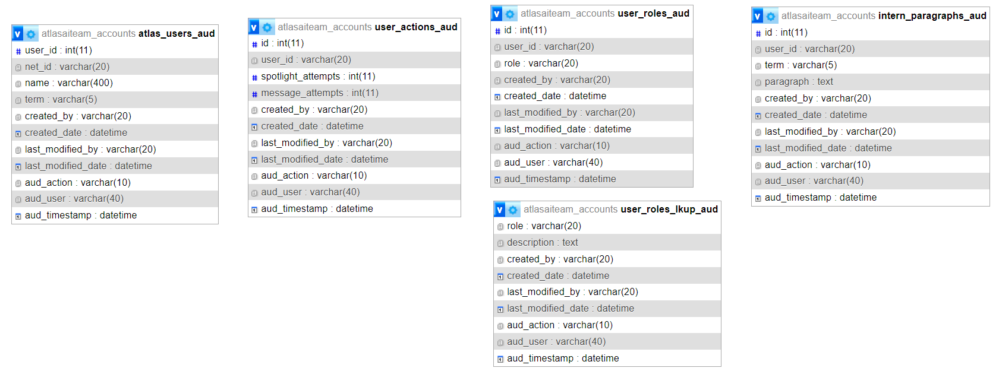
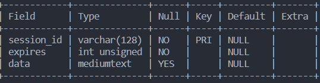
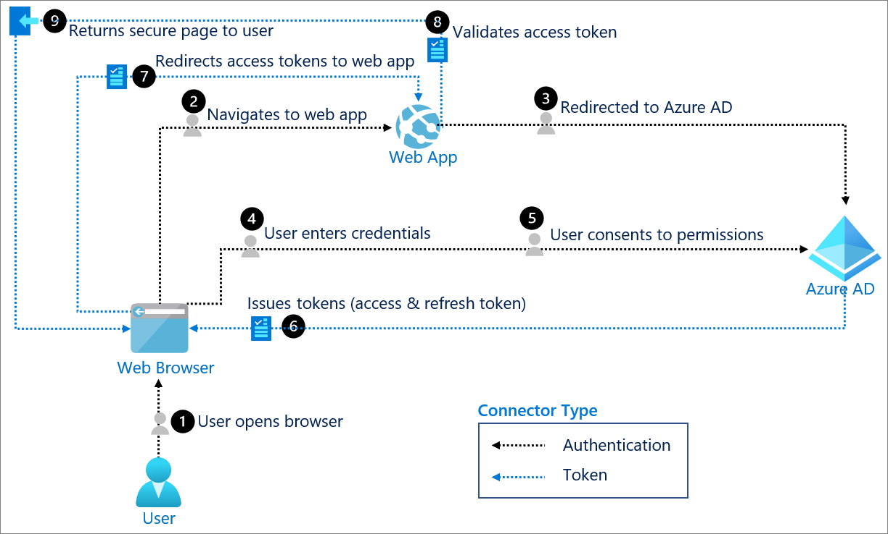

<!-- Inspiration from https://github.com/yaswant2403/Best-README-Template -->
<a name="readme-top"></a>

<!-- PROJECT SHIELDS -->
<!--
*** I'm using markdown "reference style" links for readability.
*** Reference links are enclosed in brackets [ ] instead of parentheses ( ).
*** See the bottom of this document for the declaration of the reference variables
*** for contributors-url, forks-url, etc. This is an optional, concise syntax you may use.
*** https://www.markdownguide.org/basic-syntax/#reference-style-links
-->
[![Contributors][contributors-shield]][contributors-url]
[![Issues][issues-shield]][issues-url]
[![MIT License][license-shield]][license-url]

<div align="center">
  <h3 align="center">QuikScribe - ATLAS Spotlight Generator</h3>
  <p align="center">
    Created by ATLAS AI Team of Summer 2023
  </p>
</div>

<!-- TABLE OF CONTENTS -->
<details>
  <summary>Table of Contents</summary>
  <ol>
    <li>
      <a href="#about-the-project">About The Project</a>
      <ul>
        <li><a href="#tech-stack">Tech Stack</a></li>
      </ul>
    </li>
    <li>
      <a href="#getting-started">Getting Started</a>
      <ul>
        <li><a href="#prerequisites">Prerequisites</a></li>
        <li><a href="#installation">Installation</a></li>
        <li><a href="#running-the-app">Running the App</a></li>
      </ul>
    </li>
    <li>
      <a href="">How Does It Work?</a>
      <ul>
        <li><a href="#file-structure">File Structure</a></li>
        <li><a href="#database-structure-and-table-relationships">Database Structure and Relationships</a></li>
        <li><a href="#detailed-walkthrough">Detailed Walkthrough</a></li>
      </ul>
    </li>
    <li><a href="#known-bugs">Known Bugs</a></li>
    <li><a href="#future-features">Future Features</a></li>
    <li><a href="#contributors-and-resources">Contributors and Resources</a></li>
  </ol>
</details>

<!-- ABOUT THE PROJECT -->
## About The Project
QuikScribe is a full-stack web appliction that generates customized paragraphs about an **[ATLAS](https://github.com/ATLAS-Illinois/)** Intern's journey throughout their internship. Additionally, it's a full CRUD account management system that stores interns and their paragraphs, ATLAS staff and ATLAS admin.

You can access our **[presentation](https://docs.google.com/presentation/d/1DgfxkBn4Ui_j2Y8Wq-qlC1yMxgdV__ONvFIi3VAtxJE/edit?usp=sharing)** and a **[recorded demo](https://drive.google.com/file/d/1q1DMjHw3PqpwV6xHAvwsYI3wSUMJXbNC/view?usp=sharing)**.

<p align="right">(<a href="#readme-top">back to top</a>)</p>

### Tech Stack
> **Frontend**

  * [![HTML][HTML.com]][HTML-url]
  * [![JavaScript][JavaScript.com]][JavaScript-url]
  * [![JQuery][JQuery.com]][JQuery-url]
  * [![CSS][CSS.com]][CSS-url]
  * [![Bootstrap][Bootstrap.com]][Bootstrap-url]

> **Backend**

* [![NodeJS][NodeJS.com]][NodeJS-url] + [![NPM][NPM.com]][NPM-url] 
* [![JQuery][Vite.com]][Vite-url]
* [![ExpressJS][ExpressJS.com]][ExpressJS-url]
* [![SQL][SQL.com]][SQL-url]
* [![Sequelize][Sequelize.com]][Sequelize-url]

<p align="right">(<a href="#readme-top">back to top</a>)</p>


<!-- GETTING STARTED -->
## Getting Started

There are two methods to start developing. 
  
  1. **[Highly Recommended]** Have an MySQL server setup. Once your server is setup, you would create a database using the `dump.sql` file giving you a local copy of the database on cPanel. This gives you access to the **full functionality** and features of the application.

  2. If you only want to interact with the **frontend** (changing styling or HTML) of the application, then you may choose to go with this version where there doesn't exist any authentication or database connections. However, this does **NOT include the ACCOUNT** page and only has a semifunctional Spotlight page. 

### Prerequisites

For both methods, you will need:

* node + npm
  ```bash
  # Checking if they exist
  node -v
  npm -v  
  ```
  * If your system doesn't have them yet, you can install them at [NodeJS + NPM Download](https://nodejs.org/en/download)
* API Key by going to [OpenAI](https://platform.openai.com/account/api-keys)

For **Method 1**, you will need to install MySQL into your system. 
* [Windows Installation](https://dev.mysql.com/doc/refman/8.0/en/windows-installation.html)
* [Mac Installation](https://dev.mysql.com/doc/mysql-macos-excerpt/8.0/en/macos-installation.html)
* [Ubuntu-22.04 Installation](https://www.digitalocean.com/community/tutorials/how-to-install-mysql-on-ubuntu-22-04)

  Once installed, ensure that you can create databases, create tables, insert, delete, etc. Here's a cheatsheet for different queries: [MySQL Cheatsheet](https://www.mysqltutorial.org/mysql-create-database/).

### Installation

**BOTH Methods**

1. Clone the repo
   ```bash
   git clone https://github.com/yaswant2403/atlasaiteam.git
   ```
2. Install NPM packages
   ```bash
   cd spotlight-web-app
   npm ci
   ```
3. Make a copy of `spotlight-web-app/.env.dummy.file` and rename it `.env`. Open the `.env` file and change
   ```bash
   OPEN_API_KEY = "Your OpenAI API Key you created"
   ```
**Method 1** 

  4. Create the database. With whichever client you choose, import/run the `dump.sql` file. I'll show how you can do it from the mysql command line
  ```bash
  mysql> source path-to-folder/atlasaiteam/spotlight-web-app/dump.sql 
  ```
  This will create the database with all of the tables and all of the relationships between the tables. 
  
  5. Now, let's create a new user for MySQL. Execute the following queries:
  ```sql
  CREATE USER 'user'@'localhost' IDENTIFIED BY 'any-password-you-want';

  GRANT SELECT, INSERT, UPDATE, DELETE, CREATE, DROP, RELOAD, PROCESS, REFERENCES, INDEX, ALTER, SHOW DATABASES, CREATE TEMPORARY TABLES, LOCK TABLES, EXECUTE, REPLICATION SLAVE, REPLICATION CLIENT, CREATE VIEW, SHOW VIEW, CREATE ROUTINE, ALTER ROUTINE, CREATE USER, EVENT, TRIGGER ON *.* TO 'user'@'localhost' WITH GRANT OPTION;
  ```
  This helps fix this [access denied issue][sql-user-issue] and matches up with the existing configuration.
  
  6. Open the `.env` file and change
   ```bash
   PASSWORD = "The password that you gave user@localhost"
   ```
  
  7. Now, we will need to add you as an user with the proper roles. To do, execute the following queries:
  ```sql
  INSERT INTO atlas_users (net_id, name, term, created_by) VALUES('your_netid', 'your_full_name', '120238', 'your_netid')
  SELECT user_id FROM atlas_users WHERE net_id='your_netid'; # you'll get an id number that you'll need for the next query
  INSERT INTO user_roles (user_id, role, created_by) VALUES('id_from_last_query', 'Intern', 'your_netid')
  INSERT INTO user_roles (user_id, role, created_by) VALUES('id_from_last_query', 'Staff', 'your_netid')
  ```

  8. Get a new Client Secret from [![JQuery][Azure.com]][Azure-url]. You can follow this [tutorial](https://learn.microsoft.com/en-us/answers/questions/834401/hi-i-want-my-client-id-and-client-secret-key) to obtain a new client secret. However, if you don't see `Certificates and Secrets`, you might not have permission. Please contact msommers@illinois.edu to give you permission. Once you have copied the secret, open the `.env` file and change
  ```bash
  CLIENT_SECRET = "The Client Secret you just made"
  ```

### Running the App
To run the application,

**Method 1 (With MySQL Database)** 
```bash
cd spotlight-web-app
npm run dev
```
and wait until MySQL Store is ready. Then, you can go to http://localhost:3000/ to see the website. Any change you make in `src/server/` will automatically refresh the whole server. However, if you make a change in `src/client`, you will have to manually refresh the page to see your changes. You should now be able to see yourself on the Staff Page on the Account Page. You can stop running with `CTRL or CMD C`.
 
**Method 2 (Without MySQL Database)** 
```bash
cd spotlight-web-app
npm run dev-frontend
```
Then, you can go to http://localhost:3000/ to see the website. Any change you make in `src/server/` will automatically refresh the whole server. However, if you make a change in `src/client`, you will have to manually refresh the page to see your changes.  You can stop running with `CTRL or CMD C`.


<p align="right">(<a href="#readme-top">back to top</a>)</p>

<!-- Breaking down how it works -->
## How Does It Work?

### File Structure

```bash
├── open-source-llm
|── spotlight-web-app
│   ├── index.html
│   └── src
│       ├── client
│       │   ├── assets/
│       │   ├── css/
│       │   ├── html/
│       │   └── js/
│       └── server
│           ├── config/
│           ├── db_models/
│           ├── main-client.js
│           ├── main.js
└───────────└── routes/
```
> Drawn with MS-DOS tree using a [StackOverflow Tutorial](https://stackoverflow.com/questions/347551/what-tool-to-use-to-draw-file-tree-diagram)

The entrypoint to the application is through `server/main.js` and `index.html`.

`client` folder contains all the code for the frontend of the website. Specifically, it has all the EJS files, CSS, and JS files that handle form submissions, and fetch responses from the backend. 

`server` folder contains all the code for the backend of the website. 
* `config/` contains `passport.js` which handles all the authentication using OpenID Connect with Azure Directory. 

* `db_models/` contains all the different Sequelize Models that are mapped to their respective tables in the `atlasaiteam_accounts` database. 

* `routes/` contains the `assetsRouter, cssRouter, jsRouter` which handles any assets, CSS, or JavaScript that any page of the application requires. Additionally, it has `crudRouter` which handles all the POST requests from the ACCOUNT page. 

Finally, `main.js` handles all the GET routes to the pages of the website, configures a session-store to store a user's current session, the OpenAIApi object and handles the POST request of the form submission on the Spotlight page.

### Database Structure and Table Relationships

As mentioned before, we are using a MySQL Database in cPanel called `atlasaiteam_accounts`. Here's a high-level overview of the database:


You can see every single table has 
- created_by 
- created_date
- last_modified_by
- last_modified_date

to ensure we have a comprehensive audit trail. Additionally, we also have audit tables for all our tables: 


These tables get entries inserted through triggers when the original table gets its entries updated or deleted.

`atlas_users` contains all the users of our application with the following columns:

- user_id (Unique auto-incremented id for each user since NetID can be changed)
- net_id (User's NetID)
- name (Full Name)
- term (120235 means Summer 2023, 120238 means Fall 2023, etc)

`atlas_users` has many relationships to the other tables:

* One-To-Many with `user_actions` as users can have multiple different actions. Currently, they only have _spotlight_attempts_ but in the future, we could generate resumes in which case you can just create another column called _resume_attempts_
  * Foreign Key: user_id
* One-To-Many with `intern_paragraphs` as users can have multiple paragraphs from different terms
  * Foreign Key: user_id
* Many-To-Many between users and roles since users can have various roles and roles can be assigned to many users. However, relational database systems usually don't allow you to implement a direct many-to-many relationship between two tables. Thus, the easiest way is to do it through a **junction table** (`user_roles`).
  * `user_roles_lkup` has a One-To-Many with `user_roles` as roles can be assigned to many users
    * Foreign Key: role
  * `atlas_users` has a One-To-Many with `user_roles` as users can have many roles 
    * Foreign Key: user_id
  * As such, `user_roles` allows us to uniquely identify every user and all their assigned roles

To convert these existing tables into Sequelize Models, I used [Sequelize-Auto](https://github.com/sequelize/sequelize-auto) with the additional option of `timestamps: false` which created all the models in `db_models/`. I had to slightly modify `init-models.js` in order to get the Many-To-Many relationship to work properly. 

Finally, we have the sessions table which is explained more in [Detailed Walkthrough](#detailed-walkthrough):



### Detailed Walkthrough

In this section, I'll go over how the entire web application actually functions and for even more details, you can look through the files themselves as they all have comments. 

#### I'll start with `main.js` as that's the main entrypoint of the application. 

With Vite, you can easily bootstrap your project and just start working without figuring everything out. That's great for front-end apps, but when you want to include server-side into the mix, things get quite complicated. 

With **Vite-Express**, we can write full-stack apps with only a couple of lines as it takes care of 
* injecting necessary middleware to serve static files from your express server
* managing unhandled routes to make client-side routing possible

The website uses OpenID Connect authentication with Azure Active Directory. From Microsoft Docs,
> This is an authentication protocol based on the OAuth2 protocol (which is used for authorization). OIDC uses the standardized message flows from OAuth2 to provide identity services. OIDC lets developers authenticate their users across websites and apps without having to own and manage password files. 

So in our case, we make users sign in with their Illinois Microsoft Outlook Account. In our application, **Step 8 (Valid Access Token)** is done by grabbing the user's NetID from their email that comes along with the tokens and checking if they exist in our `atlas_users` database. If they don't, they get sent to a `login_error` page. Since we're using NodeJS + Express, we use PassportJS as our authentication middleware. All of the authentication routes and passport configuration can be found in `passport.js`.

Once a user signs in, we store their **session**.  A session stores unique information about the current user of our application such that if they close the tab, they're able to access the website again without having to log in. We are using [MySQL session store for express.js](https://www.npmjs.com/package/express-mysql-session), which is compatible with express-session. This stores every session in a `sessions` table with a unique session id set to expire after 5 days. We also use PassportJS' middleware ( `passport.session()` ) that will restore that login state from a session. From PassportJS Docs,
> Web applications typically use sessions to maintain login state between requests. For example, a user will authenticate by entering credentials into a form which is submitted to the server. If the credentials are valid, a login session is established by setting a cookie containing a session identifier in the user's web browser. The web browser will send this cookie in subsequent requests to the server, allowing a session to be maintained. 
>> If sessions are being utilized, and a login session has been established, this middleware will populate req.user with the current user.

In order to access any page of the website, we use an `ensureAuthenticated()` middleware that ensures the user is authenticated by checking if they exist in our database or not. 

To serve all the assets, JS and CSS for each page, we make the use of routers. Additionally, to dynamically update pages based on a user's roles, we use **Embedded JavaScript (EJS)**. `Account` page utilizes the most of this functionality with its three cases:

1) Intern user can only see _View Paragraphs_
2) Staff user can see everything Intern can and _Manage Interns_
3) Admin user can see everything Staff can and _Manage Admin_ 

`Spotlight` page also changes based on a user's roles where all interns are able to generate paragraphs with their number of attempts displayed whereas all non-interns are unable to submit or generate any paragraphs. 

Finally, `main.js` handles the POST requests sent by the `Spotlight` page for paragraph generations.

#### Next, I'll discuss `routes/crudRouter.js` which is crucial to the Account subpages.

This contains all of the GET and POST requests from the Account subpages (_View Paragraph, Manage Interns/Staff/Admin_). This allows the user to perform all 4 operations (Create, Read, Update, Delete) on user data. Each request is handled by invoking one of Sequelize's built-in methods such as `findOne, findAll, create, update` that interacts with the tables in our database. Here's how all the different subpages operate:

* View Paragraph
  * Interns can only view their paragraph
  * Staff + Admin can view and edit all intern paragraphs
* Manage Interns
  * Staff + Admin can view, add, edit and delete interns such as full name, roles, term, spotlight attempts
* Manage Staff
  * Admin can view, add, edit and delete all staff
* Manage Admin
  * Admin can view and edit all admin

In order to add an Admin, you will have to do so manually through MySQL.

#### Finally, I'll discuss the Spotlight page.

Given the user is an intern, they will see the number of attempts available and clear instructions explaining to them how the form works. Here are the instructions:
>  When you click Generate, ChatGPT will generate 3 different paragraphs and you will LOSE 1 ATTEMPT. <br> Generated paragraphs are EDITABLE, and once you're satisfied with the paragraph, you can click SELECT and this will submit your paragraph for review! Submissions are NOT EDITABLE so choose wisely! If you'd like to generate more paragraphs, you can click Generate again BUT you will LOSE ANOTHER ATTEMPT and DELETE the previously generated paragraphs. Attempts DO NOT RESET back to 3 until the current academic term is over.

So, how did we actually do this? As soon as the user fills out the form and clicks _Generate_, `client/js/spotlight.js` verifies that the user has enough attempts and fetches a GET request from `server/main.js` which uses OpenAI's gpt-3.5-turbo model to generate three different paragraphs. After the paragraphs are generated, we decrease the number of attempts by 1, update the user's number of attempts in our database, and modify the page to reflect that change. 

<p align="right">(<a href="#readme-top">back to top</a>)</p>

## Known Bugs

### Authentication 

When a user logs in, the session that gets stored in our `sessions` table is expected to look like: 

with the `passport` value being the user that exists in the `atlas_users` table. So, whenever the user closes the tab and reopens it, Passport serializes and deserializes using this data. 

However, sometimes, the session is stored in this format:

where the passport attribute doesn't even exist. When the session is stored like this, PassportJS doesn't know who the current user is, and it's unable to redirect to any of our pages. As a result, the user continually gets sent to the `login-error` page because that's what our `failureRedirect` is set to.

As far as I can tell, this occurs randomly and sometimes the session gets stored properly and sometimes it doesn't. Here are some resources that could potentially help resolve this issue:

* [StackOverflow - Passport Always Redirected to failure redirect](https://stackoverflow.com/questions/61907280/passport-azure-ad-always-redirect-to-failureredirect-but-no-error-shown-nodejs)
* [GitHub Issues - Passport req.user is undefined](https://github.com/AzureAD/passport-azure-ad/issues/457)
* [GitHub Issues - Passport is empty in session](https://github.com/jaredhanson/passport/issues/452)
* [StackOverflow - Passport auth service not working](https://stackoverflow.com/questions/71686115/nodejs-api-on-azure-app-service-passport-auth-not-working)

<p align="right">(<a href="#readme-top">back to top</a>)</p>

## Future Features

* Store all generated paragraphs and allow user to choose and compare all 9 paragraphs
* Migrate application to cPanel and ensure that the MySQL connection works with the cPanel database
* Rebuild application using React + NextJS for better functionality and scalability
* Implement our open-source LLM rather than relying on OpenAI's models

<p align="right">(<a href="#readme-top">back to top</a>)</p>

## Contributors and Resources

<!-- ALL-CONTRIBUTORS-LIST:START - Do not remove or modify this section -->
<!-- prettier-ignore-start -->
<!-- markdownlint-disable -->
<table>
  <tbody>
    <tr>
      <td align="center" valign="top" width="14.28%"><a href="https://github.com/yaswant2403"><br /><sub><b>Yash Ejjagiri</b></sub></a><br /><a href="#" title="Code">💻</a><a href="#about-the-project" title="Documentation">📖</a></td>
      <td align="center" valign="top" width="14.28%"><a href="https://github.com/nickgong1"><br /><sub><b>Nick Gong</b></sub></a><br /><a href="#" title="Code">💻</a><a href="#about-the-project" title="Documentation">📖</a>
      <a href="#" title="Tools">🔧</a></td>
      <td align="center" valign="top" width="14.28%"><a href="https://github.com/mandoovi"><br /><sub><b>Yash Mandavia</b></sub></a><br /><a href="#" title="Code">💻</a><a href="#" title="Design">🎨</a></td>
      <td align="center" valign="top" width="14.28%"><a href="https://www.linkedin.com/in/michael-sommers-b5612b21/"><br /><sub><b>Michael Sommers</b></sub></a><br /><a href="#" title="Design">🎨</a><a href="#" title="Answering Questions">💬</a> <a href="#" title="Maintenance">🚧</a>Mentor
    </tr>
    <tr>
      <td align="center" valign="top" width="14.28%"><a href="https://www.linkedin.com/in/mrome/"><br /><sub><b>Michelle Rome</b></sub></a><br /><a href="#" title="Design">🎨</a><a href="#" title="Answering Questions">💬</a> <a href="#" title="Maintenance">🚧</a>Mentor</td>
      <td align="center" valign="top" width="14.28%"><a href="https://www.linkedin.com/in/priscilla-geerdes-33bba8255"><br /><sub><b>Priscilla Geerdes</b></sub></a><br /><a href="#" title="Answering Questions">💬</a> <a href="#" title="Maintenance">🚧</a> Coordinator</td>
      <td align="center" valign="top" width="14.28%" height="130px"><a href="https://math.illinois.edu/directory/profile/rmccrthy"><br /><sub><b>Randy McCarthy</b></sub></a><br /><a href="#" title="Design">🎨</a><a href="#" title="Answering Questions">💬</a><a href="#" title="Tools">🔧</a>Client</td>
    </tr>
  </tbody>
</table>
<!-- markdownlint-restore -->
<!-- prettier-ignore-end -->

<!-- ALL-CONTRIBUTORS-LIST:END -->

### Resources Used
Thank you to our amazing team of mentors for all their help thoroughout the project.
All of the resources we used can be found here: [Resources - Google Docs](https://docs.google.com/document/d/1Yvs7tJFcdjcbIhXztb_aJP1fVm7Gsq9j5ODua-Bkxc0/edit?usp=sharing)

<p align="right">(<a href="#readme-top">back to top</a>)</p>

<!-- MARKDOWN LINKS & IMAGES -->
<!-- https://www.markdownguide.org/basic-syntax/#reference-style-links -->
[contributors-shield]: https://img.shields.io/github/contributors/yaswant2403/atlasaiteam.svg?style=for-the-badge
[contributors-url]: https://github.com/yaswant2403/atlasaiteam/graphs/contributors
[issues-shield]: https://img.shields.io/github/issues/yaswant2403/atlasaiteam.svg?style=for-the-badge
[issues-url]: https://github.com/yaswant2403/atlasaiteam/issues
[license-shield]: https://img.shields.io/badge/License-GNU%20GPL-blue?style=for-the-badge
[license-url]: https://github.com/yaswant2403/atlasaiteam/blob/main/LICENSE

[Next.js]: https://img.shields.io/badge/next.js-000000?style=for-the-badge&logo=nextdotjs&logoColor=white
[Next-url]: https://nextjs.org/
[React.js]: https://img.shields.io/badge/React-20232A?style=for-the-badge&logo=react&logoColor=61DAFB
[React-url]: https://reactjs.org/

<!-- Frontend -->
[HTML.com]: https://img.shields.io/badge/HTML5-E34F26?style=for-the-badge&logo=html5&logoColor=white
[HTML-url]: https://developer.mozilla.org/en-US/docs/Web/HTML
[JavaScript.com]: https://img.shields.io/badge/JavaScript-323330?style=for-the-badge&logo=javascript&logoColor=F7DF1E
[JavaScript-url]: https://www.javascript.com/
[JQuery.com]: https://img.shields.io/badge/jQuery-0769AD?style=for-the-badge&logo=jquery&logoColor=white
[JQuery-url]: https://jquery.com 
[CSS.com]: https://img.shields.io/badge/CSS3-1572B6?style=for-the-badge&logo=css3&logoColor=white
[CSS-url]: https://developer.mozilla.org/en-US/docs/Web/CSS
[Bootstrap.com]: https://img.shields.io/badge/Bootstrap-563D7C?style=for-the-badge&logo=bootstrap&logoColor=white
[Bootstrap-url]: https://getbootstrap.com
<!-- Backend -->

[NodeJS.com]: https://img.shields.io/badge/Node%20js-339933?style=for-the-badge&logo=nodedotjs&logoColor=white
[NodeJS-url]: https://nodejs.org/en/download
[NPM.com]: https://img.shields.io/badge/npm-CB3837?style=for-the-badge&logo=npm&logoColor=white
[NPM-url]: https://www.npmjs.com/
[Vite.com]: https://img.shields.io/badge/Vite-B73BFE?style=for-the-badge&logo=vite&logoColor=FFD62E
[Vite-url]: https://vitejs.dev/
[ExpressJS-url]: https://expressjs.com/
[ExpressJS.com]: https://img.shields.io/badge/Express%20js-000000?style=for-the-badge&logo=express&logoColor=white
[SQL.com]: https://img.shields.io/badge/MySQL-005C84?style=for-the-badge&logo=mysql&logoColor=white
[SQL-url]: https://www.mysql.com/
[Sequelize.com]: https://img.shields.io/badge/Sequelize-52B0E7?style=for-the-badge&logo=Sequelize&logoColor=white
[Sequelize-url]: https://sequelize.org/

[sql-user-issue]: https://stackoverflow.com/questions/40477625/nodejs-mysql-er-access-denied-error-access-denied-for-user-rootlocalhost?page=1&tab=scoredesc#tab-top

[MDNWebDocs.com]: 	https://img.shields.io/badge/MDN_Web_Docs-black?style=for-the-badge&logo=mdnwebdocs&logoColor=white
[MDNWebDocs-url]: https://developer.mozilla.org/en-US/docs/Web
[Azure.com]: https://img.shields.io/badge/microsoft%20azure-0089D6?style=for-the-badge&logo=microsoft-azure&logoColor=white
[Azure-url]: https://portal.azure.com/#view/Microsoft_AAD_RegisteredApps/ApplicationMenuBlade/~/Overview/appId/0ee72bd2-5571-417d-a595-f83f13b2a45f/isMSAApp~/false
[VSCode.com]: https://img.shields.io/badge/VSCode-0078D4?style=for-the-badge&logo=visual%20studio%20code&logoColor=white
[VSCode-url]: https://code.visualstudio.com/

